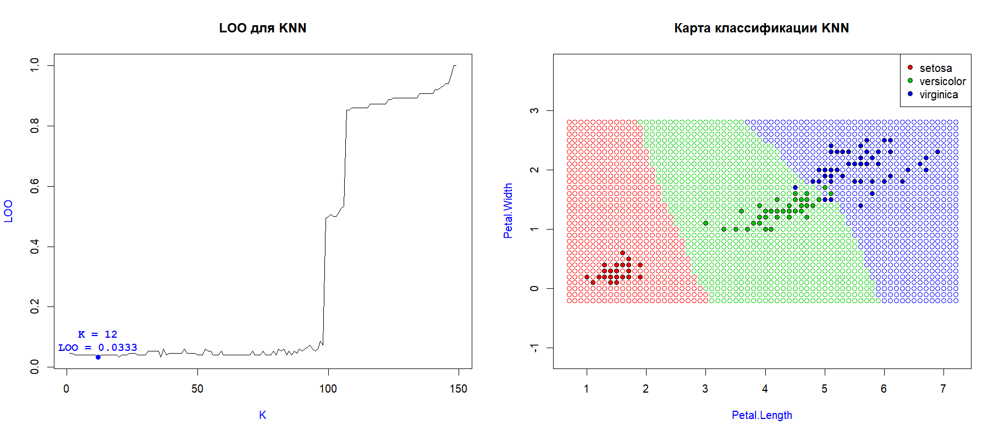
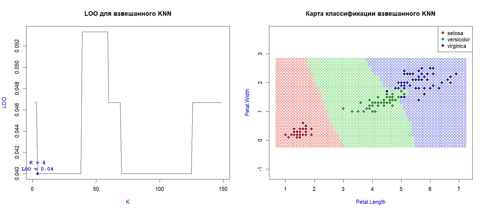
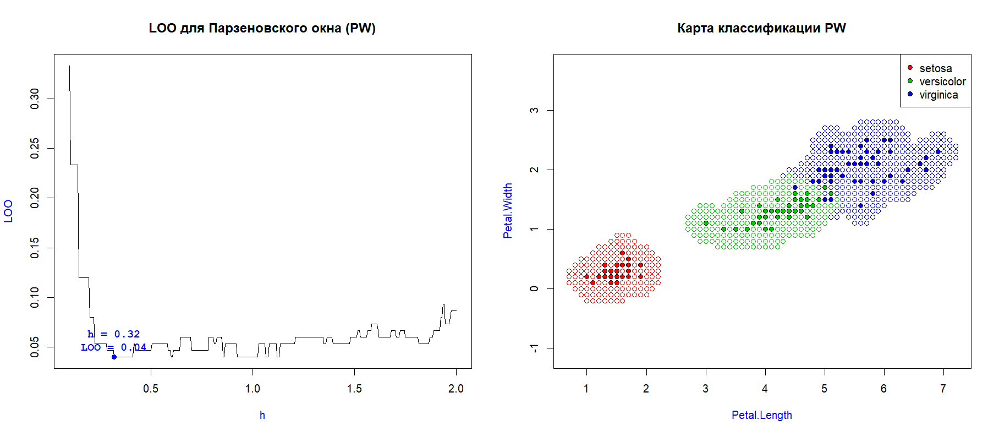

# Методы принятия решений

Этот файл содержит описание и результаты всех проделанных нами работ. Работы
подготовили:
_Орлова Татьяна и Юлия Ивлева, 401-И_

## Навигация

- [Метрические алгоритмы классификации](#Метрические-алгоритмы-классификации)
  - [K ближайших соседей (KNN)](#k-ближайших-соседей-knn)
  - [K взвешанных ближайших соседей (KNN)](#k-взвешанных-ближайших-соседей-knn)
  - [Парзеновское окно (PW)](#Парзеновское-окно-pw)

## Метрические алгоритмы классификации

Метрические алгоритмы классификации основаны на __гипотезе компактности__,
которая говорит о том, что <u>схожим объектам соответствуют схожие ответы</u>.

Функцию, определяющую "схожесть" объектов называют __мерой близости__.
Эта функция определяется следующим образом:

(функция расстояния)

Все дальнейшие методы будут основаны на анализе сходства объектов.

### K ближайших соседей (KNN)

Для оценки близости объекта _u_ к классу _y_ алгоритм использует следующую
функцию:

, где _i_ обозначает порядок соседа по расстоянию к точке _u_.

Другими словами, алгоритм выбирает _k_ ближайших соседей и возвращает
тот класс, который среди выбранных встречается большее количество раз.

Реализация алгоритма доступна по
[ссылке](oRRRlova/KNN.R)

#### Оценка алгоритма

Протестируем алгоритм на выборке ирисов Фишера:

Алгоритм хорошо себя показывает при небольшом _k_, допуская ошибку лишь в
нескольких объектах, однако при росте _k_, начиная с _k > 95_, ошибка
стремительно растет. Это объясняется тем, что функция оценки близости

никак не учитывает порядок элементов, а учитывает лишь их наличие. Из-за
этого те объекты, что находятся очень далеко от точки _u_ влияют на
классификацию с такой же силой, что и объекты, находящиеся в
непосредственной близости.

__Плюсы:__
- прост в реализации
- неплохие результаты при правильно подобраном _k_

__Минусы:__
- необходимо хранить всю выборку целиком
- классификация точки занимает

, так как требует сортировку точек по расстоянию
- бедный набор параметров
- примитивная оценка близости
- в случае одинаковых весов классов алгоритм выбирает любой
- не все точки с одинаковым расстоянием будут учитаны

### K взвешанных ближайших соседей (KNN)

Для оценки близости объекта _u_ к классу _y_ алгоритм использует следующую
функцию:

, где _i_ обозначает порядок соседа по расстоянию к точке _u_, а 
 — строго
убывающая функция веса. Последней алгоритм __взвешанного KNN__ отличается
от __KNN__.

Мы же будем применять следующую функцию веса:

Реализация алгоритма доступна по
[ссылке](oRRRlova/KNN.R)

#### Оценка алгоритма

Протестируем алгоритм на выборке ирисов Фишера:

Алгоритм хорошо себя показывает при любом _k_, отклонение максимальной ошибки
к минимальной всего лишь в двух объектах.

Алгоритм __взвешанных k соседей__ качественно отличается от обычного
__KNN__ тем, что <u>учитывает порядок объектов</u> при классификации. Тем
самым, ближние к точке _u_ объекты будут влиять на нее гораздо сильнее, чем
дальние. Однако из-за этой особенности, при большом _k_ дальние точки
быстро обесцениваются, поэтому функцию

следует выбирать осторожно.

__Плюсы:__
- прост в реализации
- неплохие результаты при любом _k_

__Минусы:__
- необходимо хранить всю выборку целиком
- классификация точки занимает

, так как требует сортировку точек по расстоянию
- бедный набор параметров
- в случае одинаковых весов классов алгоритм выбирает любой
(однако стоит заметить, что эти случаи будут встречаться крайне редко)
- не все точки с одинаковым расстоянием будут учитаны

### Парзеновское окно (PW)

Для оценки близости объекта _u_ к классу _y_ алгоритм использует следующую
функцию:

, где 
 — функция ядра.

Чаще всего применяются 4 типа ядер:
- Прямоугольное 
- Треугольное 
- Квартическое 
- Епанечниково 

Мы в программе будем применять <u>прямоугольное</u> ядро, однако его легко
можно заменить на любое из 4-х перечисленных. Ядра на качество классификации
влияют очень слабо.

__Простыми словами:__ алгоритм для классифицируемой точки _u_ строит
окружность, радиусом _h_. Все точки, не попавшие в эту окружность,
отсеиваются (хотя это зависит от ядра). Для остальных, вычисляется вес,
суммируется, и класс с наибольшим весом считается победителем.

Реализация алгоритма доступна по
[ссылке](oRRRlova/PW.R)

#### Оценка алгоритма

Протестируем алгоритм на выборке ирисов Фишера:

Алгоритм хорошо себя показывает при _h_ лишь в небольшом диапазоне.
Этот диапазон зависит от плотности классифицируемых точек.

Алгоритм Парзеновского прост в понимании и реализации (даже проще, чем
__KNN__). Он имеет достаточно маленькую ошибку в определенном промежутке,
 однако имеет ряд существенных недостатков, которыми __KNN__ и __взвешанный
KNN__ не обладают.

__Плюсы:__
- прост в реализации
- неплохие результаты при правильно подобраном _h_
- все точки с одинаковым расстоянием будут учитаны
- классификация точки занимает

, так как не требует сортировки

__Минусы:__
- необходимо хранить всю выборку целиком
- бедный набор параметров
- в случае одинаковых весов классов алгоритм выбирает любой
(однако стоит заметить, что эти случаи будут встречаться редко)
- диапазон параметра _h_ необходимо подбирать самостоятельно, учитывая
плотность расположения точек
- если ни одна точка не попала в радиус _h_, алгоритм не способен ее
классифицировать (см. рисунок)! На наш взгляд, это самый существенный
недостаток