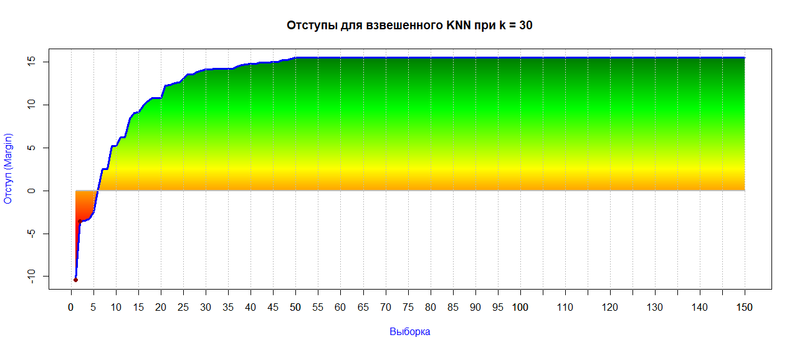
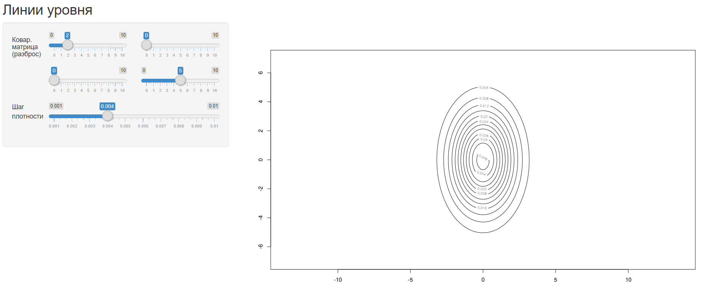
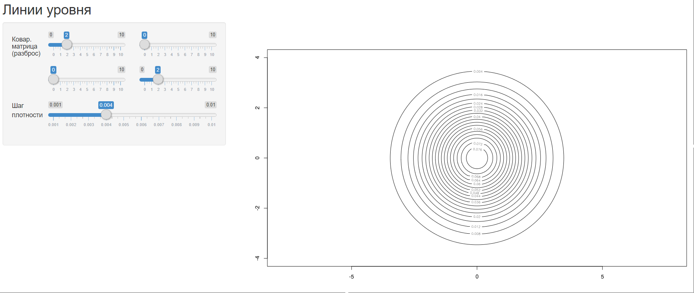
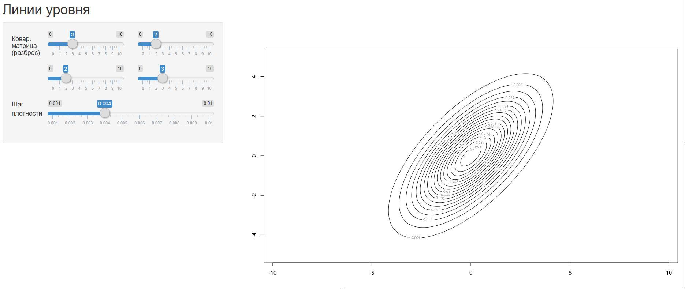
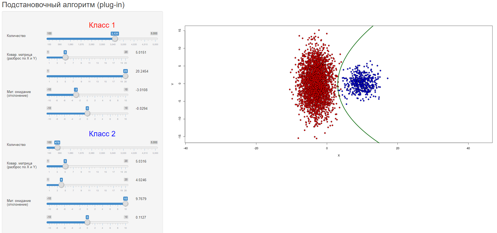
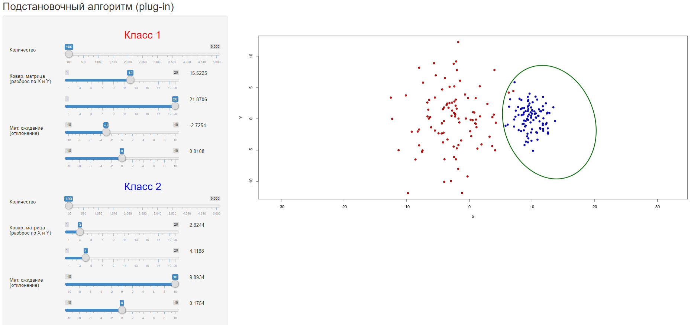
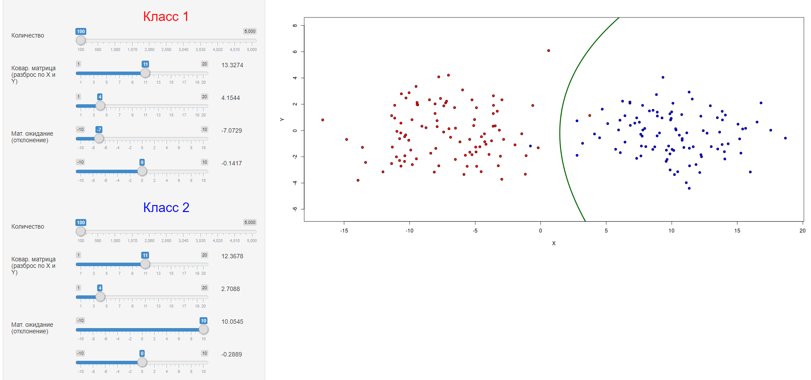
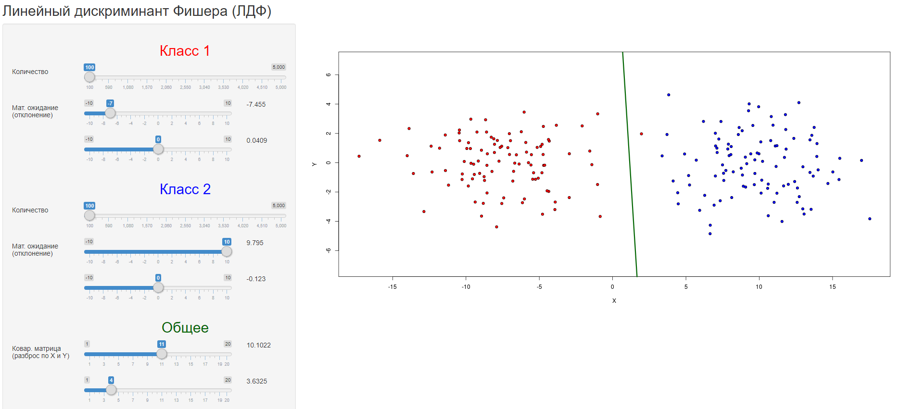

# Методы принятия решений

Этот файл содержит описание и результаты всех проделанных нами работ. Работы
подготовили:
_Орлова Татьяна и Юлия Ивлева, 401-И_

## Навигация

- [Метрические алгоритмы классификации](#Метрические-алгоритмы-классификации)
  - [K ближайших соседей (KNN)](#k-ближайших-соседей-knn)
  - [K взвешенных ближайших соседей (kwKNN)](#k-взвешенных-ближайших-соседей-kwknn)
  - [Парзеновское окно (PW)](#Парзеновское-окно-pw)
  - [Потенциальные функции (PF)](#Потенциальные-функции-pf)
  - [STOLP](#stolp)
- [Байесовские классификаторы](#Байесовские-классификаторы)
  - [Нормальный дискриминантный анализ](#Нормальный-дискриминантный-анализ)
  - [Подстановочный алгоритм (Plug-in)](#Подстановочный-алгоритм-plug-in)
  - [Линейный дискриминант Фишера (ЛДФ)](#Линейный-дискриминант-Фишера-ЛДФ)

## Метрические алгоритмы классификации

__Гипотеза компактности__ утверждает, что схожим объектам соответствуют схожие ответы.

Метрические алгоритмы классификации основаны на __гипотезе компактности__,
которая говорит о том, что <u>схожим объектам соответствуют схожие ответы</u>.

Функцию, определяющую "схожесть" объектов называют __мерой близости__.
Эта функция определяется следующим образом:


(функция расстояния)

_Метрические алгоритмы классификации_ основаны на анализе сходства объектов с помощью
ранее описанной функции _расстояния_. Собственно, чем расстояние меньше, чем больше
объекты похожи друг на друга.

<u>Примечание</u>. Чтобы запустить алгоритм классификации на тестовой выборке необходимо
вызвать функцию `test()`.

### K ближайших соседей (KNN)

Для оценки близости объекта _u_ к классу _y_ алгоритм использует следующую
функцию:

, где _i_ обозначает порядок соседа по расстоянию к точке _u_.

Программно, функция веса реализуется следующим образом:
```
mc.KNN.w = function(i, k) +(i <= k)
```

Другими словами, алгоритм выбирает _k_ ближайших соседей и возвращает
тот класс, который среди выбранных встречается большее количество раз.

Программно алгоритм реализуется следующим образом:
```
mc.KNN = function(sortedDistances, k) {
    orderedDistances = 1:length(sortedDistances)
    names(orderedDistances) = names(sortedDistances)

    weights = mc.KNN.w(orderedDistances, k)
    weightsByClass = sapply(unique(names(weights)), mc.sumByClass, weights)

    bestClass = names(which.max(weightsByClass))
}
```
где `sortedDistances` – массив расстояний от неизвестной `u` до всех точек обучающей
выборки. `names(sortedDistances)` – наименование классов для каждой точки выборки.

Реализация алгоритма доступна по
[ссылке](oRRRlova/KNN.R)

#### Оценка алгоритма

Протестируем алгоритм на выборке ирисов Фишера:


Алгоритм дает маленькую погрешность (5 ошибок) при небольшом _k_, однако при росте _k_, начиная
 с _k > 95_, ошибка
стремительно растет. Это объясняется тем, что функция оценки близости

никак не учитывает порядок элементов, а учитывает лишь их наличие. Из-за
этого те объекты, что находятся очень далеко от точки _u_ влияют на
классификацию с такой же силой, что и объекты, находящиеся в
непосредственной близости.

__Плюсы:__
- прост в реализации
- неплохие результаты при правильно подобраном _k_

__Минусы:__
- необходимо хранить всю выборку целиком
- классификация точки занимает

, так как требует сортировку точек по расстоянию
- бедный набор параметров
- примитивная оценка близости
- в случае одинаковых весов классов алгоритм выбирает любой
- не все точки с одинаковым расстоянием будут учитаны

### K взвешенных ближайших соседей (kwKNN)

Для оценки близости объекта _u_ к классу _y_ алгоритм использует следующую
функцию:

, где _i_ обозначает порядок соседа по расстоянию к точке _u_, а 
 — строго
убывающая функция веса. Последней алгоритм __взвешенного KNN__ отличается
от __KNN__.

Мы же будем применять следующую функцию веса:


Программно функция веса реализуется следующим образом:
```
mc.kwKNN.w = function(i, k) +(i <= k) * (k + 1 - i) / k
```

Сам же алгоритм ничем, кроме функции веса, от __KNN__ не отличается.
Подставив `mc.kwKNN.w` вместо `mc.KNN.w` получим необходимый алгоритм.

Реализация алгоритма доступна по
[ссылке](oRRRlova/kwKNN.R)

#### Оценка алгоритма

Протестируем алгоритм на выборке ирисов Фишера:


Алгоритм демонстрирует маленькую погрешность при любом _k_, отклонение максимальной ошибки
к минимальной всего лишь в двух объектах.

Алгоритм __взвешенных k соседей__ качественно отличается от обычного
__KNN__ тем, что <u>учитывает порядок объектов</u> при классификации. Тем
самым, ближние к точке _u_ объекты будут влиять на нее гораздо сильнее, чем
дальние. Однако из-за этой особенности, при большом _k_ дальние точки
быстро обесцениваются, поэтому функцию

следует выбирать осторожно.

__Плюсы:__
- прост в реализации
- неплохие результаты при любом _k_

__Минусы:__
- необходимо хранить всю выборку целиком
- классификация точки занимает

, так как требует сортировку точек по расстоянию
- бедный набор параметров
- в случае одинаковых весов классов алгоритм выбирает любой
(однако стоит заметить, что эти случаи будут встречаться крайне редко)
- не все точки с одинаковым расстоянием будут учитаны

### Парзеновское окно (PW)

Для оценки близости объекта _u_ к классу _y_ алгоритм использует следующую
функцию:


, где 
 — функция ядра.

Чаще всего применяются 5 типов ядер:
- Прямоугольное 
- Треугольное 
- Квартическое 
- Епанечниково 
- Гауссовское (нормальное распределение)

Программная реализация ядер:
```
mc.kernel.R = function(r) 0.5 * (abs(r) <= 1) #прямоугольное
mc.kernel.T = function(r)(1 - abs(r)) * (abs(r) <= 1) #треугольное
mc.kernel.Q = function(r)(15 / 16) * (1 - r ^ 2) ^ 2 * (abs(r) <= 1) #квартическое
mc.kernel.E = function(r)(3 / 4) * (1 - r ^ 2) * (abs(r) <= 1) #епанечниково
mc.kernel.G = function(r) dnorm(r) #гауссовское
```

В программе ядра будут применяться поочередно.
Однако на разницу в качестве классификации они влияют слабо.
Выделяется лишь _гауссовское ядро_ (см. ниже).

__Простыми словами:__ алгоритм для классифицируемой точки _u_ строит
окружность, радиусом _h_. Все точки, не попавшие в эту окружность,
отсеиваются (кроме гауссовского). Для остальных, вычисляется вес,
суммируется, и класс с наибольшим весом считается победителем.

Программная реализация алгоритма:
```
mc.PW = function(distances, u, h) {
    weights = mc.PW.kernel(distances / h)
    classes = unique(names(distances))

    weightsByClass = sapply(classes, mc.sumByClass, weights)

    if (max(weightsByClass) == 0) return("") #ни одна точка не попала в окно

    return(names(which.max(weightsByClass)))
}
```
где `distances` – расстояние от точки `u` до всех точек выборки,
`names(distances)` – наименование классов точек выборки.

Реализация алгоритма доступна по
[ссылке](oRRRlova/PW.R)

#### Оценка алгоритма

Протестируем алгоритм на выборке ирисов Фишера:

_Прямоугольное ядро:_


_Треугольное ядро:_


_Квартическое ядро:_


_Епанечково ядро:_


Алгоритм хорошо себя показывает при _h_ лишь в небольшом диапазоне.
Этот диапазон зависит от плотности классифицируемых точек. Если _h_ сделать
слишком маленьким, количество точек, способных к классификации заметно уменьшится.
Если _h_ сделать слишком большим, он начнет учитывать при
классификации слишком дальние точки. Однако стоит отметить, что в некоторых ядрах
веса дальних точек гораздо меньше, и качество алгоритма при больших _h_ падает не так
сильно. Неудачным ядром (по мнению авторов программной реализации)
является _прямоугольное_, так как веса
всех точек внутри окна одинаковые.

Все вышеописанные ядра имеют весомый недостаток – они не способны
классифицировать точки, не попавшие ни в одно окно. Этот недостаток
устраняет гауссовское ядро.

_Гауссовское ядро:_


Алгоритм Парзеновского окна прост в понимании и реализации (даже проще, чем
__KNN__). Он имеет удовлетворительное качество классификации,
 однако имеет и ряд недостатков, которыми __KNN__ и __взвешанный
KNN__ не обладают.

__Плюсы:__
- прост в реализации
- хорошее качество классификации при правильно подобраном _h_
- все точки с одинаковым расстоянием будут учитаны
- классификация точки занимает

, так как не требует сортировки

__Минусы:__
- необходимо хранить всю выборку целиком
- бедный набор параметров
- в случае одинаковых весов классов алгоритм выбирает любой
(однако стоит заметить, что эти случаи будут встречаться редко)
- диапазон параметра _h_ необходимо подбирать самостоятельно, учитывая
плотность расположения точек
- если ни одна точка не попала в радиус _h_, алгоритм не способен ее
классифицировать (не актуально для гауссовского ядра)

### Потенциальные функции (PF)

Для оценки близости объекта _u_ к классу _y_ алгоритм использует следующую
функцию:


, где 
 — функция ядра.

В программной реализации применяется квартическое ядро.
Алгоритм подбирает только силу потенциала
, радиусы потенциалов
_h_ известны заранее.

__Простыми словами:__ алгоритм для каждого обучающего объекта _x_ строит
окружность, радиуса _h_ и силы воздействия (потенциала)
.

Программная реализация функции классификации:
```
mc.PF = function(distances, potentials, h) {
    weights = potentials * mc.PF.kernel(distances / h)
    classes = unique(names(distances))

    weightsByClass = sapply(classes, mc.sumByClass, weights)

    if (max(weightsByClass) == 0) return("") #ни одна точка не попала в окно

    return(names(which.max(weightsByClass)))
}
```
где `potentials` и `h` – массивы потенциалов и радиусов для каждой точки выборки
соответственно.

Однако, прежде, чем использовать потенциалы, их необходимо подобрать. Этот процесс
также входит в обязанности _PF_.

<u>Описание</u>:
Изачально потенциалы заполняются нулями. Далее, пока количество ошибок классификации
не достигнет нужного предела, выбираем случайно точку _x_ из выборки. Если для нее
классификация выполняется неверно, увеличиваем потенциал на 1 и пересчитываем
общее количество ошибок.

Функция вызывается следующим образом:
```
mc.PF.potentials(points, classes, h, maxMistakes)
```
где `points` и `classes` – массив точек и их классов соответственно,
`h` – массив предпосчитанных радиусов каждой точки,
`maxMistakes` – максимальное количество допустимых ошибок.

Реализация алгоритма доступна по
[ссылке](oRRRlova/PF.R)

#### Оценка алгоритма

Протестируем алгоритм на выборке ирисов Фишера. .Так как целью работы является
подбор
, а не _h_, то
выбирем их любым образом (пускай для красных точек _h = 1_, так как они
отделены от остальной обучающей выборки; остальным присвоим _h = 0.25_).

Алгоритм подобрал оптимальные параметры (4 ошибки) за 16 проходов:


Алгоритм заметно сложнее в понимании и реализации, чем предшествующие
алгоритмы. К тому же подбор силы потенциалов занимает долгое время. К
сожалению, это время оценить невозможно, так как алгоритм является
случайным (следующий _x_ в итерации берется случайным образом). При
запуске алгоритма на одной и той же выборке, он показывает разное время
работы, разную итоговую ошибку, а также разное количество итераций.

__Плюсы:__
- результат зависит от _2n_ параметров

__Минусы:__
- необходимо хранить всю выборку целиком
- параметры _h_ необходимо подбирать самостоятельно, алгоритм
в их подборе не принимает участия
- если ни одна точка не попала в радиус _h_, алгоритм не способен ее
классифицировать (не актуально для гауссовского ядра)
- медленно сходится
- слишком грубо настраивает параметры
- неопределенное время работы (при маленьком пороге ошибки может вообще
выполняться бесконечно)

### STOLP

Выделяют несколько выдов объектов обучения:

- _Эталонные_ — типичные представители классов. Если классифицируемый
объект близок к эталону, то, скорее всего, он принадлежит тому же классу.
- _Неинформативные_ — плотно окружены
другими объектами того же класса. Если их удалить из выборки, это практически
не отразится на качестве классификации.
- _Выбросы_ — находятся в окружении объектов чужого класса. Как правило,
- их удаление только улучшает качество классификации.

Алгорим **STOLP** исключает из выборки выбросы и неинформативные
объекты, оставляя лишь нужное количество эталонных. Таким образом
улучшается качество классификации, сокращается объем данных и уменьшается
время классификации объектов. Другими словами **STOLP** — алгоритм
сжатия данных.

Он использует функцию отступа:


 является весовой
функцией и зависит от выбранного алгоритма классификации.

Программно функция веса реализуется следующим образом:
```
mc.STOLP.w = function(sortedDistances, indecies, k) {
    if (length(indecies) == 0) return(0)

    orderedDistances = 1:length(sortedDistances)
    names(orderedDistances) = names(sortedDistances)
    weights = mc.kwKNN.w(orderedDistances, k)

    weights = weights[indecies]
    if (length(weights) == 0) return(0)

    weightsByClass = sapply(unique(names(weights)), mc.sumByClass, weights)
    max(weightsByClass)[1]
}
```
где `indecies` – индексы точек, гдя которых ее необходимо подсчитать, если
`indecies < 0` – индексы точек, которые необходимо выкинуть перед подсчетом.
Функция основана на функции веса __KNN__, поэтому передается дополнительный
параметр `k` и используется `mc.kwKNN.w`. Реализация __STOLP__ для других
алгоритмов классификации будет немного отличаться.

Программная реализация функции отступа:
```
mc.STOLP.M = function(points, classes, u, class) {
    k = 4
    dist = mc.distances(points, u)
    names(dist) = classes
    sortedDistances = sort(dist)

    #Отсутуп относительно данного класса
    uIndecies = which(sapply(names(sortedDistances), function(v) any(v == class)))
    m1 = mc.STOLP.w(sortedDistances, uIndecies, k)

    #Отступ относительно других классов
    m2 = mc.STOLP.w(sortedDistances, - uIndecies, k)

    #Отступ
    m1 - m2
}
```
где `class` – класс _Xi_-й точки выборки.

Эти функции используются как вспомогательные для основного алгоритма __STOLP__.

<u>Описание</u>: 
Алгоритм удаляет все выбросы из начальной выборки.
Далее из каждого класса выбирается по этолонному объекту
(с самым большим отступом) и они записываются в массив.
Далее, пока количество ошибок на всей выборке не будет удовлетворять условию,
выбираем из оставшихся объектов точку с самым маленьким отступом и добавляем
в массив.

Алгоритм вызывается следующей функцией:
```
mc.STOLP = function(points, classes, mistakes)
```
где `mistakes` – допустимое количество ошибок.

Выбросы из выборки определяются автоматически и удаляются в начале алгоритма.
Определяются они следующим образом: алгоритм выделяет все объекты с
отрицательным отступом, сортирует и среди всех выбирает тот, с которого
начинается самый большой скачок вниз. Этот объект и определяет
верхнюю грань множества _шумовых объектов_.

Сам алгоритм громоздкий, его реализация доступна по
[ссылке](oRRRlova/STOLP.R)

#### Оценка алгоритма

Протестируем алгоритм на выборке ирисов Фишера. В качестве алгоритма
классификации рассмотрим **взвешанный KNN** и его весовую функцию:
.

Между соседними типами объектов не существуют четких разграничений, поэтому
границу _выбросов_ установим сами. Будем называть выбросом объект, отступ
которого `< -1`.

Как мы знаем из предыдущих работ, алгоритм **kwKNN** дает лучший результат
(6 ошибок) при практически любом `k` (возьмем, `k = 30`).

Классификация отступов выглядит следующим образом (красная точка - выброс):

Выборка содержит огромное количество
_эталонных_ объектов, а это означает, что в выборке очень много "ненужных" классификации
объектов, а, следовательно, их можно удалить не испортив классификатор.

Попытаемся улучшить алгоритм с помощью **STOLP**, сократив
количество ошибок в 2 раза.

С поставленной задачей алгоритм справился за 10 проходов,
допустив всего _2 ошибки_ на эталонной выборке:


Как можно заметить, выборка сократилась со 150-ти до 8-ти объектов (в 18 раз),
тем самым ускорив время классификации.

__Плюсы:__
- в разы уменьшает размер выборки
- способен улучшить качество классификации

__Минусы:__
- сложный в реализации

## Байесовские классификаторы

Байесовский подход к классификации основан на теореме, утверждающей,
что если плотности распределения каждого из классов известны,
то искомый алгоритм можно выписать в явном виде.
Более того, этот алгоритм оптимален,
то есть обладает минимальной вероятностью ошибок.

Для классифицируемого объекта вычисляются функции правдоподобия каждого
из классов, по ним вычисляются апостериорные вероятности классов.
Объект относится к тому классу, для которого __апостериорная вероятность
максимальна__.


На практике _плотности распределения классов_, как правило, не известны.
Их приходится оценивать (восстанавливать) по обучающей выборке.
В результате байесовский алгоритм перестаёт быть оптимальным,
так как восстановить плотность по выборке можно только с некоторой погрешностью.

__Разделяющая поверхность__ между классами _t_ и _s_ – это геометрическое
место точек

таких, что _максимум апостериорной вероятности_ достигается одновременно
при _y = s_ и _y = t_.

.

Следующие алгоритмы по исходным выборкам восстанавливают _плотности распределения
классов_ и отдеяют классы друг от друга при помощи
_разделяющей поверхности_.

### Нормальный дискриминантный анализ

Это специальный случай баесовской классификации, когда предполагается, что плотности
всех классов

являются многомерными нормальными. В этом случае задача решается аналитически.
Сами плотности вычисляются по формуле:

,
в которой


– объект, состоящий из *n* признаков,


– математическое ожидание,


– ковариационная матрица (положительно определенная, симметричная, невырожденная).

#### Геометрия нормальной плотности

1. Если признаки некореллированы, то есть

, то плотности распределения имеют форму эллипсоидов, параллельных осям координат:



2. Если признаки имеют одинаковые дисперсии
,
линии уровня имеют форму эллипсоидов:



3. Если матрица не диагональна, то линии уровня – эллипсоиды, повернутые относительно
оси координат:




### Подстановочный алгоритм (Plug-in)

__Подстановочный алгоритм__ относится к нормальному дискриминантному анализу.

Чтобы узнать _плотности распределения классов_, алогритм восстанавливает
неизвестные параметры

по следующим формулам для каждого класса _y_ :


```
estimateMu = function(points) {
    rows = dim(points)[1]
    cols = dim(points)[2]
    mu = matrix(NA, 1, cols)
    for (col in 1:cols) {
        mu[1, col] = mean(points[, col])
    }
    return(mu)
}
```

.

```
estimateCovarianceMatrix = function(points, mu) {
    rows = dim(points)[1]
    cols = dim(points)[2]
    covar = matrix(0, cols, cols)
    for (i in 1:rows) {
        covar = covar + (t(points[i,] - mu) %*% (points[i,] - mu)) / (rows - 1)
    }
    return(covar)
}
```

#### Оценка алгоритма

Протестируем алгоритм на двух сгенерированных на основе нормального распределения
выборках, посмотрим, насколько восстановленные значения отличаются от исходных,
и какие разделяющие поверхности между классами он нарисует.

Программа доступна по ссылке:
[shinyapps.io](https://orlova-tatiana.shinyapps.io/plug-in/).

Алгоритм довольно точно восстанавливает _ковариационную матрицу_ и
_мат. ожидание_ объектов выборки.



Однако при малом количестве количестве объектов, точность падает:



### Линейный дискриминант Фишера (ЛДФ)

__ЛДФ__ основан на __подстановочном алгоритме__ с предположением,
что ковариационные матрицы классов равны. Отсюда следует, что
разделяющая поверхность вырождается в прямую. Это условие в
__plug-in__ не выполнялось, так как разделяющая поверхность все равно
была квадратичной (хоть и приближенной к прямой). Отсюда следует,
что __ЛДФ__ должен иметь более высокое качество классификации при
одинаковых ковариационных матрицах.

Программно алгоритм отличается от __подстановочного__ пересчетом
_ковариационной матрицы_ и поиском _разделяющей поверхности_.

Так как матрицы равны, можем оценить их все вместе:


```
estimateCovarianceMatrix = function(xy1, mu1, xy2, mu2) {
    rows1 = dim(xy1)[1]
    rows2 = dim(xy2)[1]
    rows = rows1 + rows2
    cols = dim(xy1)[2]
    sigma = matrix(0, cols, cols)

    for (i in 1:rows1)
        sigma = sigma + (t(xy1[i,] - mu1) %*% (xy1[i,] - mu1))

    for (i in 1:rows2)
        sigma = sigma + (t(xy2[i,] - mu2) %*% (xy2[i,] - mu2))

    return(sigma / (rows + 2))
}
```

Разделяющая поверхность имеет вид:

, где

,

.

```
getLDFCoeffs = function(covar, mu1, mu2) {
    invCovar = solve(covar)
    alpha = invCovar %*% t(mu1 - mu2)
    beta = (mu1 %*% invCovar %*% t(mu1) - mu2 %*% invCovar %*% t(mu2)) / 2
    list("alpha" = alpha, "beta" = beta)
}
```

#### Оценка алгоритма

Программа доступна по ссылке:
[shinyapps.io](https://orlova-tatiana.shinyapps.io/fisher/)

Сравним результаты двух алгоритмов с одинаковыми параметрами:





При одинаковых выборках __подстановочный алгоритм__ визуально близок
к __ЛДФ__ и разницу можно увидеть лишь при малом количестве объектов
выборки.

Причем, чем меньше объектов в выборке, тем очевидней превосходство
__ЛДФ__ над __подстановочным алгоритмом__ при одинаковых
ковариационных матрицах.
